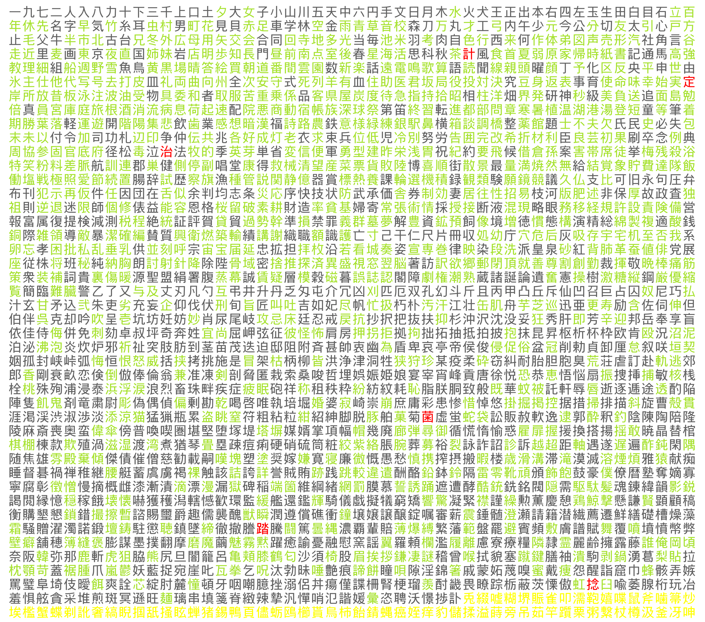

# Yokutango - よく使う単語

Dette er en personlig samling av json-formaterte "puggekort" for japansk ↔ norske gloser.

Det er mer en digitalisering/backup enn noe som stadig blir oppdatert, så oversettelser blir ikke forbedret, og det blir ikke lagt nye gloser til. Det eneste som blir oppdatert er romaji som er direkte feil / har en skrivefeil.

|  |
|:--:| 
| *Oversikt over hvilke kanji som er inkludert. Grønn er inkludert, rød har havnet med flere ganger, og gule er kanji som er uvanlige (ikke del av 常用)* |

## Format

- Det må være minst én japansk oversettelse.
- Det må være minst én norsk oversettelse.
- En japanske oversettelsen må inneholde word-feltet.
- Om det japanske ordet hovedsakelig bare har kana, så vil ordet ligge i word-feltet, og det vil ikke eksistere et kana-felt.
- De japanske oversettelsene inneholder ofte kanji som er enten sjeldne eller veldig gamle og ubrukt. Ikke ta for gitt at man må kunne kanji-varianten
- Ordsettet inneholder også noen få eksempler av det motsatte: ord som mangler kanji. Det skal kun være få av disse.
- Hints kan være eksempler på kontekst, eller eksempler på bruk av ordet. De kan være ment å sette foran eller bak ordene, alt etter kontekst. Oftest står de bak.

```json
 {
    "japanese": [
      {
        "word": "例",
        "romaji": "れい"
      }
    ],
    "norwegian": [
      {
        "word": "eksempel"
      },
      {
        "word": "test",
        "hints": ["for å vise"]
      },
    ]
  }
```

## Innhold

Noen av ordene er skrevet på engelsk eller inneholder engelske hint. Dette er som oftest enten fordi at det engelske ordet uttrykket betydningen eller nyansen i ordet bedre, eller så er det bare fordi jeg ikke har kommet på det norske ordet akkurat der og da.

Det er flere steder hvor jeg skriver ett ord som har flere betydninger, men bare noterer den ene betydningen.

## Kanji

Kanjikortene består av én side med ord som bruker kanjien, og kanjien på andre siden. Når ordene består av flere kanji (eller inneholder hjelpeord for kontekst), så deles de opp i en liste. Det er da delen hvor `"active": true` som er uttalelsen for kanjien. Slike oppdelte ord må ha minst én slik bit.

### Format


```json
 {
    "kana": [
      "たとえば",
      [
        {"text": "i parantes"},
        {"text": "ikke i parantes", "active": true},
        {"text": i parantes}
      ],
      [{ "text": "annen", "active": true }, { "text": "struktur" }]
    ],
    "kanji": "例",
    "hints": ["for eksempel"]
  }
```

## Processing

I [processing-mappen](processing) ligger det et par python-script som skal hjelpe med rengjøring og oversikt/statistikk. Der finnes blant annet programmet som genererte bildet øverst.